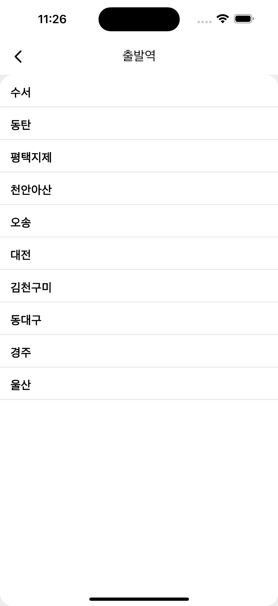
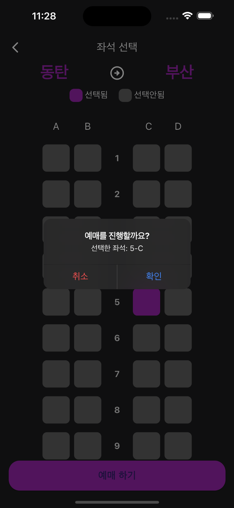

# 🚆 Flutter 기차 예매 앱

Flutter로 만든 기차 예매 앱입니다. 출발역과 도착역을 선택하고, 좌석을 선택한 후 예매할 수 있는 기능을 제공합니다.  
라이트 모드 / 다크 모드를지원합니다 

## ✨ 주요 기능

- 출발역 / 도착역 선택
- 선택한 역에 따라 역 리스트 필터링 (동일역 예외 처리)
- 좌석 선택 UI (좌석은 4열 x 20행 = 80개)
- 선택 좌석 시 색상 변경
- 좌석 예매 버튼 클릭 시 다이얼로그로 예매 확인
- 라이트/다크 테마 지원

## 📁 폴더 구조
lib/ ├── pages/ │ ├── home/ │ │ ├── home_page.dart # 홈화면 - 출발/도착역 선택 │ │ └── widgets/ │ │ └── select_box.dart # 출발/도착역 선택 박스 │ ├── seat/ │ │ ├── seat_page.dart # 좌석 선택 페이지 │ │ └── widgets/ │ │ ├── seat_bottom.dart # 예매하기 버튼 │ │ └── seat_select_box.dart # 좌석 선택 UI │ └── station/ │ └── station_list_page.dart # 역 리스트 페이지 ├── app_theme.dart # 라이트 / 다크 테마 정의 └── main.dart # 앱 시작점

## 📸 스크린샷

### Light Mode

| 홈화면 | 출발역 선택 | 좌석 선택 | 예매 확인 |
|--------|-------------|------------|------------|
|  |  |  |  |

### Dark Mode

| 홈화면 | 출발역 선택 | 좌석 선택 | 예매 확인 |
|--------|-------------|------------|------------|
|  |  |  |  |

> 이미지들은 실제 앱 시뮬레이터에서 캡처한 화면입니다.

## 🛠️ 사용 기술

- Flutter – 크로스플랫폼 UI 프레임워크

- Dart – Flutter 앱 개발 언어

- Material Design – 기본 위젯 및 스타일 구성

- Cupertino Dialog – iOS 스타일의 알림창 적용

- Stateful / Stateless Widget – 상태 관리 및 화면 구성

- Navigator – 페이지 이동 및 데이터 전달

- ListView / GestureDetector / GridView – 리스트 및 터치 이벤트 처리

- ThemeMode (Light/Dark) – 라이트/다크 테마 전환 및 사용자 정의 테마 작성

- Custom Widget 분리 및 재사용 – SelectBox, SeatBottom, SeatSelectBox 등으로 구성

- Context 기반 Theme 적용 – Theme.of(context)를 이용한 동적 스타일링

---

### 만든이 🧑‍💻  
전진주✨  

